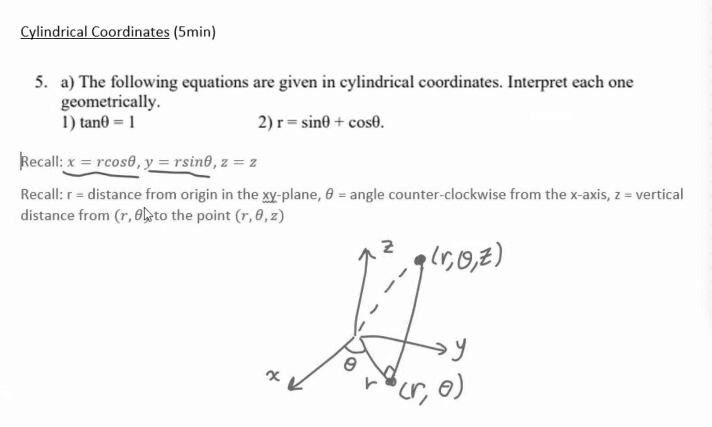

# Image Compression Tool

## Description: 
This tool can create filters for given images and works by taking an image and storing
image pixels in an array allowing pixel manipulations to be made to allow filters. There
is a folder called filter_previews which shows the different types of filter and how they
look applied to a sample image. Images are saved as .jpg files

Examples:
- blue filter

- blur filer

- blur filter 3x3

- blur filter 4x3

- blurry image filter

- cropped image filter

- edge detection filter

- green filter

- greyscale alternate filter

- greyscale filter

- liminosity filter

- pink filter

- reduce opacity filter

- sharpen filter

- unsharpen mask filter

- yellow filter

### Supported image extensions:
### - jpg
### - png
### - icns
### - ico
### - im
### - j2p
### - jpx
### - j2x
### - msp
### - pcx

## Instructions:
### 1. clone repository: `git clone https://github.com/apinanyogaratnam/Image-Compression-Tool.git`
### 2. change directory to src
### 3. unix: `python3 interactive.py` | windows: `python interactive.py` | or run interactive.py
### 4. Place image to be processed in the main directory
### 5. Follow the instructions for applying desired filters

## Libraries:
### https://github.com/python-pillow/Pillow

## Resources:
### https://www.codingame.com/playgrounds/2524/basic-image-manipulation/introduction
